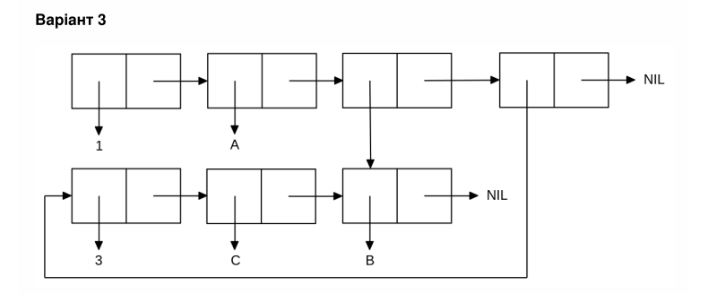

<p align="center"><b>МОНУ НТУУ КПІ ім. Ігоря Сікорського ФПМ СПіСКС</b></p>
<p align="center">
<b>Звіт з лабораторної роботи 1</b><br/>
"Обробка списків з використанням базових функцій"<br/>
дисципліни "Вступ до функціонального програмування"
</p>
<p align="right"><b>Студент</b>: Булавчук Данило, КВ-23</p>
<p align="right"><b>Рік</b>: 2025</p>

## Загальне завдання

```lisp
;; 1. Створення списку
* (defvar *my-list* (list 42 'hello '(a b) nil 100))
*MY-LIST*
* *my-list*
(42 HELLO (A B) NIL 100)

;; 2. Отримання голови списку
* (car *my-list*)
42

;; 3. Отримання хвоста списку
* (cdr *my-list*)
(HELLO (A B) NIL 100)

;; 4. Отримання третього елемента списку
* (third *my-list*)
(A B)

;; 5. Отримання останнього елемента списку
* (car (last *my-list*))
100

;; 6. Використання предикатів ATOM та LISTP
* (atom (car *my-list*))
T
* (listp (third *my-list*))
T
* (atom *my-list*)
NIL
* (listp (car *my-list*))
NIL

;; 7. Використання інших предикатів
* (numberp (first *my-list*))
T
* (null (fourth *my-list*))
T

;; 8. Об'єднання списку з одним із його непустих підсписків
* (append *my-list* (third *my-list*))
(42 HELLO (A B) NIL 100 A B)
```
## Варіант 3

<p  align="center">

</p>

```lisp
;; Створення списку за варіантом 3
* (list 1 (list 'A 'B 'C) 2)

(1 (A B C) 2)
